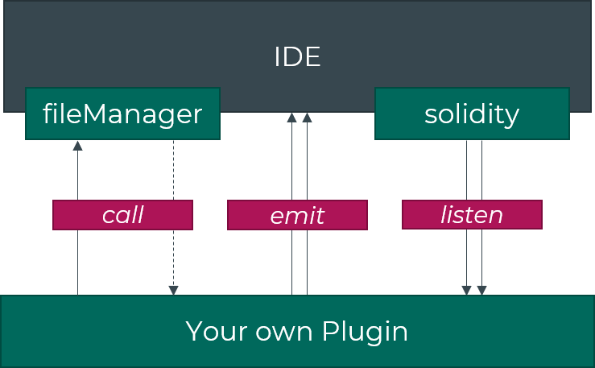

# Remix Plugin

> For the old api, go to [api](./doc/api.md)

ALPHA : This version is still a work in progress and some breaks may be expected (especially names). But the overall stucture should remain unchanged.

## Getting Started

Installation : 
```bash
npm install remix-plugin
```

or with a unpkg : 
```html
<script src="https://unpkg.com/remix-plugin"></script>
```

## Remix Extension
`RemixExtension` helps you communicate with the IDE.

To import it you can use ES6 if installed with npm : 
```javascript
import { RemixExtension } from 'remix-plugin'
const extension = new RemixExtension()
```

Or with a global variable if you used unpkg : 
```javascript
const { RemixExtension } = remixPlugin
const extension = new RemixExtension()
```

---
## DevMode
Plugins communicate with the IDE through the `postMessage` API. It means that `RemixExtension` needs to know the origin of your IDE.

If you're developping a plugin with your IDE running on `localhost` you'll need to specify the port on which your IDE runs : 
```typescript
extension.setDevMode(8000) 
```
or 
```typescript
extension.setDevMode()  // default is port 8080
```

---

### Loaded
`RemixExtension` listen on a first handshake from the IDE before beeing able to communicate back. For that you need to wait for the Promise `loaded` to be called.

```javascript
extension.loaded().then(_ => /* Do Something now */)
```

Or with the `async` / `await` syntax : 
```javascript
await extension.loaded()
// Do Something now
```

### Listen
To listen to an event you need to provide the name of the plugin your listening on, and the name of the event : 
```javascript
extension.listen(/* pluginName */, /* eventName */, ...arguments)
```

For exemple if you want to listen to Solidity compilation : 
```javascript
extension.listen('solidity', 'compilationFinished', (target, source, version, data) => {
    /* Do Something on Compilation */
  }
)
```

> See all available event [below](#api).

### Call 
You can call some methods exposed by the IDE with with the method `call`. You need to provide the name of the plugin, the name of the method, and the arguments of the methods : 
```javascript
await extension.call(/* pluginName */, /* methodName */, ...arguments)
```
> Note: `call` is alway Promise

For example if you want to upsert the current file : 
```typescript
async function upsertCurrentFile(content: string) {
  const path = await extension.call('fileManager', 'getCurrentFile')
  await extension.call('fileManager', 'setFile', path, content)
}
```

> Note: Be sure that your plugin is loaded before making any call.

### Emit
Your plugin can emit events that other plugins can listen on.
```javascript
extension.emit(/* eventName */, ...arguments)
```

Let's say your plugin build a deploy a Readme for your contract on IPFS : 
```javascript
async function deployReadme(content) {
  const [ result ] = await ipfs.files.add(content);
  extension.emit('readmeDeployed', result.hash)
}
```

> Note: Be sure that your plugin is loaded before making any call.

<div align="center">

</div>

### Testing your plugin
You can test your plugin direcly on the [alpha version of Remix-IDE](https://remix-alpha.ethereum.org). Go to the `pluginManager` (plug icon in the sidebar), and click "Connect to a Local Plugin".

Here you can add : 
- A name : this is the name used by other plugin to listen to your events.
- A displayName : Used by the IDE.
- The url : May be a localhost for testing.

> Note: No need to do anything if you localhost auto-reload, a new `handshake` will be send by the IDE.

### Publish your plugin
This is not available now.

# API
This API is a Work In Progress and will be extended in the future.

### Permission
Some of the APIs have to be used with caution. So they might ask the permission of the user.

|API                  |name         |Permission |
|---------------------|-------------|-----------|
|File Manager         |fileManager  |✅
|Solidity Compiler    |solidity     |✅
|Transaction Listener |txlistener   |


## fileManager

|Type     |Name               |Parameters   |Types |
|---------|-------------------|-------------|-----
|_event_  |currentFileChanged |fileName     |string
|_method_ |getFilesFromPath   |path         |string
|_method_ |getCurrentFile     |
|_method_ |getFile            |path         |string
|_method_ |setFile            |path         |string
|         |                   |content      |string

### Events
currentFileChanged
```typescript
extension.listen('fileManager', 'currentFileChanged', (fileName: string) => {
  // Do something
})
```

### Methods
getFilesFromPath
```typescript
const filesTree = await extension.call('fileManager', 'getFilesFromPath', path)
```

getCurrentFile
```typescript
const currentFile = await extension.call('fileManager', 'getCurrentFile')
```

getFile
```typescript
const content = await extension.call('fileManager', 'getFile', path)
```

setFile
```typescript
await extension.call('fileManager', 'setFile', path, content)
```

## solidity

|Type     |Name                 |Parameters   |Types |
|---------|---------------------|-------------|-----
|_event_  |compilationFinished  |fileName     |string
|         |                     |source       |Object
|         |                     |version      |string
|         |                     |data         |Object


### Events
compilationFinished
```typescript
extension.listen('solidity', 'compilationFinished', (fileName: string, source: Object, version: string, data: Object) => {
  // Do something
})
```

## txlistener
|Type     |Name                 |Parameters   |Types |
|---------|---------------------|-------------|-----
|_event_  |newTransaction       |tx           |Object

### Events
newTransaction
```typescript
extension.listen('txlistener', 'newTransaction', (tx: Object) => {
  // Do Something
})
```


# Status
Every plugin has a status object that can display notifications on the IDE. You can listen on a change of status from any plugin using `statusChanged` event : 

```typescript
extension.listen('fileManager', 'statusChanged', (status: Status) => {
  // Do Something 
})
```

The status object is used for displaying a notification. It looks like that : 
```typescript
interface Status {
  iconName: string  // Name of the icon from font-awesome
  type: 'success' | 'info' | 'warning' | 'danger'  // Bootstrap css variable to use
  title?: string  // Describe the status on mouseover
}
```

You can also change the status of your own plugin by emitting the same event : 
```typescript
extension.emit('statusChanged', { iconName: 'check', type: 'success', title: 'Documentation ready !' })
```
> The IDE can use this status to display a notification to the user.