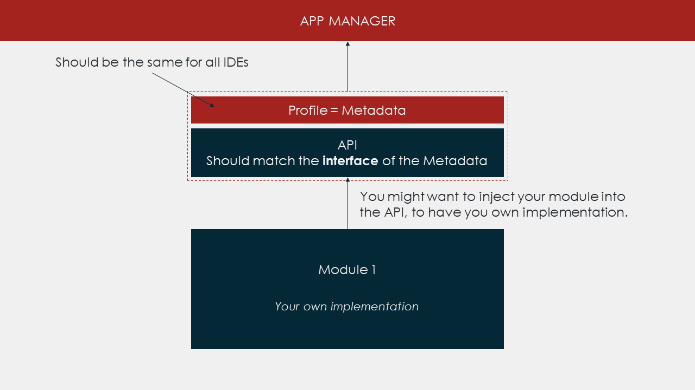

# Remix Plugin and Modules

> For the old api, go to [api](./api.md)

This project aims to build an interoperable way of communicating amongst the IDE developped on top of Remix technologies. It's based on modules and plugins communicating with each other through an `AppManager`.

## Module vs Plugins

- Modules: Internal logic, build by the core team, that runs inside the IDE.
- Plugin: External logic, build by the community, that runs inside iframes.

## Build a Module
If you're building a module for your own IDE, you just have to add : 
- Interface of the Api: (**Typescript Only**) An interface to describe the types.
- A Profile: A JSON object with metadata that describe your module.
- An API: A class that inject your module and exposes public methods and events to other modules and plugins.

### Api Interface (**Typescript Only**)
```typescript
export interface Compiler extends Api {
  type: 'solCompiler'
  events: {
    compilationFinished: { success: boolean; data: any; source: any }
  }
  lastCompilationResult(): any
}
```

- `type`: The name of your module.
- `events`: A map with the name of the events exposed, and the type of content it carries on.
- The rest of the keys are methods exposed by the module.

### Profile
```typescript
export const CompilerProfile: ModuleProfile<Compiler> = {
  type: 'solCompiler',
  methods: ['lastCompilationResult'],
  events: ['compilationFinished']
}
```

- `type`: The name of the module.
- `methods`: An array with the names of the methods exposed.
- `events`: An array with the names of the events exposed.

### API
```typescript
export class CompilerApi implements API<Compiler> {
  public readonly type = 'solCompiler'
  public events: ApiEventEmitter<Compiler> = new EventEmitter()

  constructor(private compiler) {}

  public lastCompilationResult() {
    return this.compiler.lastResult
  }

}
```

- `type`: Readonly name of the module.
- `events`: A node.js `EventEmitter` based on this [library](https://www.npmjs.com/package/events). The `ApiEventEmitter` is an helper to get the name and types of the events.
- `private compiler`: This is your implementation of the module.
- `lastCompilationResult`: This method can be called by other modules and plugins.

> The `API` helps maintaining a separation between your code and the rest of the IDE, exposing only what you want.

#### Manage events
In this example the implementation of the module uses `rxjs` to deal with events: 
```typescript
export class CompilerApi implements API<Compiler> {
  private isActivated = true
  public readonly type = 'solCompiler'
  public events: ApiEventEmitter<Compiler> = new EventEmitter()

  constructor(private compiler) {}

  public activate() {
    this.compiler.compilationFinish.pipe(
      takeWhile(() => this.isActivated)
    ).subscribe(result => this.events.emit('compilationFinished', result))
  }

  public deactivate() {
    this.events.removeAllListeners()
    this.isActivated = false
  }
}
```

- `activate()`: This method is called by default when the module is registered by the `AppManager`. You should **start listening on events** here (and not inside the constructor).
- `deactivate()`: This method is called when the user doesn't not want to use to the module anymore. This is up to the IDE developer to enable user to deactivate modules. You should **remove every listeners** here. 

> We needed a standard way of dealing with `events` that is why we use a node.js friendly [library](https://www.npmjs.com/package/events). 

### Examples
You can find example of modules here : 
- [Solidity Compiler](./examples/modules/compiler.module.ts)
- [Solidity Resolver](./examples/modules/resolver.module.ts)
- [TxListener](./examples/modules/txlistener.module.ts)
- [Udapp](./examples/modules/udapp.module.ts)
- [Plugin Manager](./examples/modules/plugManager.module.ts): Module that manage activation and deactivation of the plugins.

### Overview


## Build a Plugin

## AppManager
